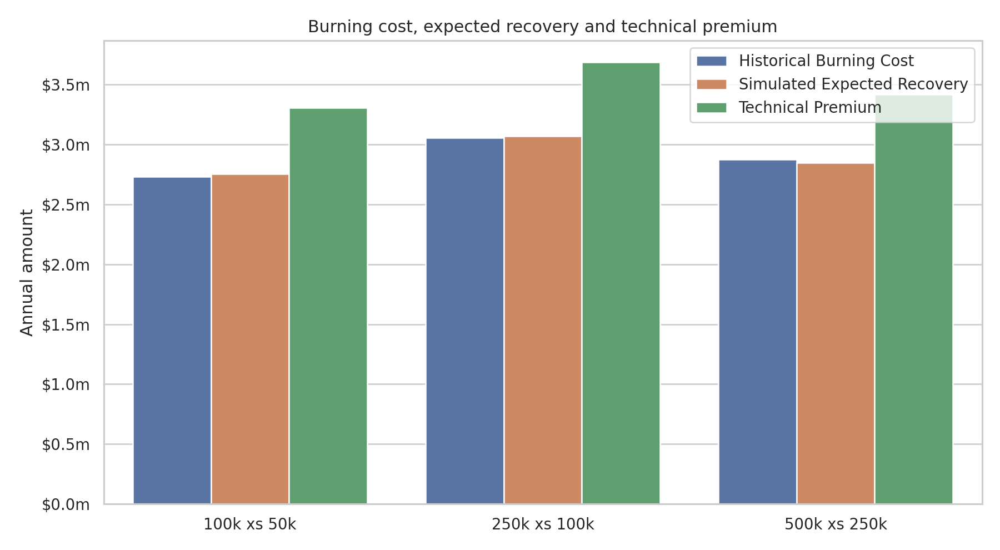
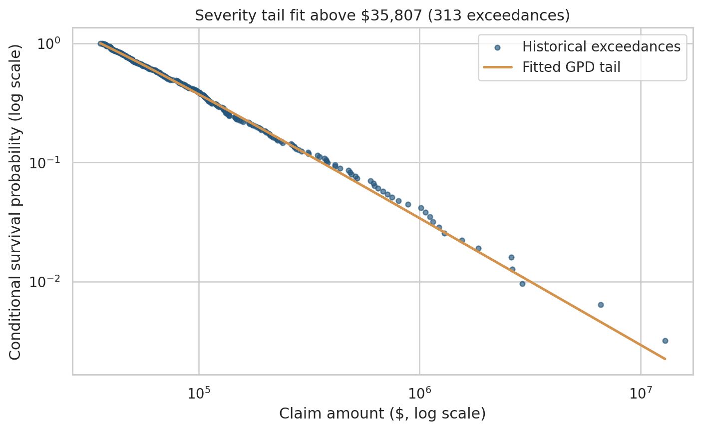
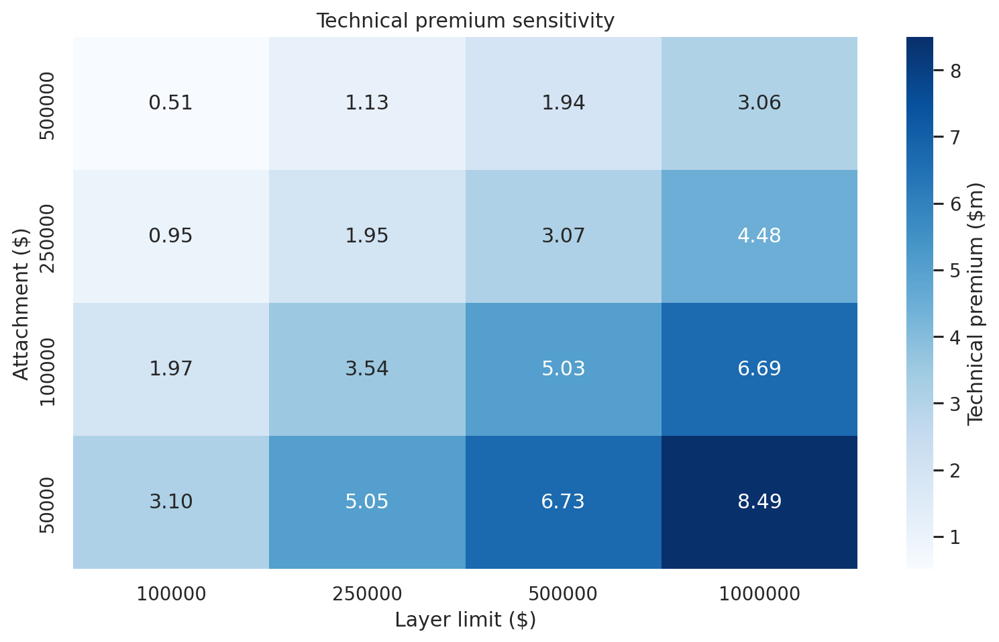

# Excess-of-Loss Reinsurance Pricing Engine

This project prices per-claim excess-of-loss (XoL) reinsurance using five years of historical property claims and policy exposure data. It combines exposure-adjusted burning costs with 10,000 Monte Carlo simulations to compare attachment points and limits.

The question I wanted to explore was: how does changing an XoL layer alter the insurer's retention, the reinsurer's expected recovery and the risk reflected in the technical premium?

## Model specification at a glance

- **Frequency:** exposure-adjusted Negative Binomial claim counts.
- **Severity:** empirical resampling up to the 95th percentile, with a fitted Generalized Pareto tail above it.
- **Pricing:** 5% of expected recovery for expenses, plus 25% of simulated standard deviation as a risk load.
- **Simulation:** 10,000 years using seed 42 and a batch size of 500.

The saved tables and figures were regenerated using this specification.

## Key results

| Layer | Historical burning cost | Simulated expected recovery | CV | 95th percentile | Technical premium |
|---|---:|---:|---:|---:|---:|
| 100k xs 50k | $2.732m | $2.779m | 26.6% | $4.085m | $3.103m |
| 250k xs 100k | $3.058m | $3.132m | 32.3% | $4.954m | $3.542m |
| 500k xs 250k | $2.874m | $2.646m | 44.4% | $4.768m | $3.072m |

The premium uses a 5% expense loading plus 25% of the simulated standard deviation as a risk load. These are illustrative assumptions rather than quoted market terms. The method deliberately gives a higher percentage loading to the more volatile layers: the effective loadings above are 11.7%, 13.1% and 16.1%, respectively.



## Data

The source is the Wisconsin Local Government Property Insurance Fund case study published in the open-access [Loss Data Analytics](https://openacttexts.github.io/Loss-Data-Analytics/ChapIntro.html) textbook.

- 6,258 claims from 2006–2010
- 5,639 policy-years
- Mean claim: $15,585.90
- Median claim: $1,837
- Maximum claim: $12,922,217.84
- 70.2% of policy-years had no claims
- Claim-frequency mean: 1.109; sample variance: 73.088

The large difference between the mean and median, together with the maximum loss of almost $13m, shows why an XoL analysis depends heavily on the right tail rather than the typical claim.

## Method

### 1. Reinsurance recovery

For a claim amount `X`, attachment `A` and layer limit `L`, the recovery is:

```text
recovery = min(max(X - A, 0), L)
```

For example, a $180,000 claim under a 100k xs 50k layer produces a $100,000 recovery. The insurer retains the first $50,000 and the portion above $150,000.

### 2. Historical burning cost

I calculated the actual recovery for each claim and layer, aggregated it by year and rebased each year to the 2010 portfolio exposure using total building and contents coverage (`BCcov`). The average exposure-adjusted annual recovery is the historical burning cost.

### 3. Frequency model

Claim frequency is heavily overdispersed: its variance is much larger than its mean. I therefore used a Negative Binomial model rather than a Poisson model. Expected claim counts are proportional to `BCcov`, with the dispersion parameter estimated by the method of moments across all policy-years.

This gives an expected 1,362 claims for the 2010-base portfolio. The code retains a Poisson fallback when the estimated overdispersion is zero.

### 4. Severity model

A pure empirical bootstrap cannot produce a claim larger than the historical maximum. That is a significant weakness for XoL work, so I use a hybrid severity model:

- losses up to the 95th percentile are resampled from the historical data;
- excesses above the threshold are fitted with a Generalized Pareto Distribution (GPD); and
- each simulated tail loss equals the threshold plus a draw from the fitted GPD.

The fitted threshold is $35,807, based on 313 exceedances. The fitted GPD has shape 0.938 and scale $39,560. This allows simulated claims beyond the historical maximum, while the per-claim layer limits keep the modelled recoveries finite.



### 5. Monte Carlo simulation

Each simulated year follows two steps:

1. Simulate policy-level claim counts from the fitted Negative Binomial model.
2. Simulate individual claim amounts from the empirical-body/GPD-tail severity model and apply each XoL layer.

The same simulated claims are used across all layers so the comparison is consistent. Exact random draws are reproducible for the fixed seed, batch size and code version used here. Changing the batch size changes the random-number call order and can therefore produce different, but statistically equivalent, results.

Frequency and severity are simulated independently. This is a simplifying assumption: catastrophe or other large-loss years may produce both more claims and larger claims, so independence can understate the joint annual tail when frequency and severity move together.

### 6. Technical premium

The pricing function is:

```text
technical premium = expected recovery × (1 + expense loading)
                  + volatility factor × simulation standard deviation
```

For the parameters used in this project, this becomes:

```text
technical premium = expected recovery × 1.05 + 0.25 × simulation standard deviation
```

The 5% term is an expense allowance. The standard-deviation term is a simple risk load, so more volatile layers receive a larger loading. It is still an illustrative pricing principle and not a substitute for a full capital model or commercial judgement.

I also tested 16 attachment-and-limit combinations to show how price and volatility respond as the reinsurer takes more or less of the tail.



## Findings

- The 250k xs 100k layer has the largest expected recovery of the three selected structures because its wider limit captures more loss despite attaching higher.
- The 500k xs 250k layer has the highest coefficient of variation (44.4%) and therefore the highest effective loading (16.1%).
- Historical burning costs and simulated expected recoveries are within 2.4% for the first two layers. The 500k xs 250k result is around 8.0% below the historical burning cost, reflecting greater tail uncertainty at the higher attachment.
- Increasing the attachment reduces the technical premium, while increasing the layer limit increases it. Across the sensitivity grid, premiums range from approximately $0.51m to $8.49m.
- 2,810 claims (44.9%) are below their listed deductible. I retain them as recorded ground-up/informational losses and document this treatment rather than silently removing them.

## Project structure

```text
├── data/
│   └── README.md
├── outputs/
│   ├── figures/
│   └── tables/
├── src/
│   └── xol_pricing_engine.py
├── tests/
│   └── test_xol_pricing_engine.py
├── run_analysis.py
├── requirements.txt
└── README.md
```

The raw source CSVs are not committed. `data/README.md` records their source, expected filenames and treatment.

## Running the project

Use Python 3.11 or later. The published results were generated with Python 3.12.13 and the exact dependency versions in `requirements.txt`.

1. Download the two source CSVs described in `data/README.md` and place them in `data/`.
2. Install the dependencies:

```bash
pip install -r requirements.txt
```

3. Run the analysis:

```bash
python run_analysis.py
```

4. Run the calculation checks:

```bash
python -m unittest discover -v tests
```

## Tests

The test suite contains 13 checks covering:

- layer recovery below, inside and above the layer;
- missing files, invalid columns, invalid claims and unmatched exposure years;
- the frequency method-of-moments calculation and Poisson fallback;
- fitting and sampling the GPD tail, including losses beyond the historical maximum;
- annual recovery aggregation; and
- the standard-deviation premium loading.

## Limitations and next steps

- Five years is limited experience for fitting a heavy severity tail. The GPD result is sensitive to the selected threshold and should be tested at alternative thresholds before real pricing use.
- The estimated shape parameter is high, signalling a very heavy and uncertain tail. Layer limits constrain recoveries, but parameter uncertainty is not included.
- Frequency and severity are independent. A future version could model a shared catastrophe-year effect or use event-level catastrophe data.
- The standard-deviation load is risk-sensitive but still simplified. It does not explicitly model capital, cost of capital, brokerage or market conditions.
- No explicit claims inflation, reinstatements, aggregate limits or claims-development adjustments are included.
- Exact seeded output also depends on the documented batch size and code version.

This is an educational pricing model, not a production quotation tool.
